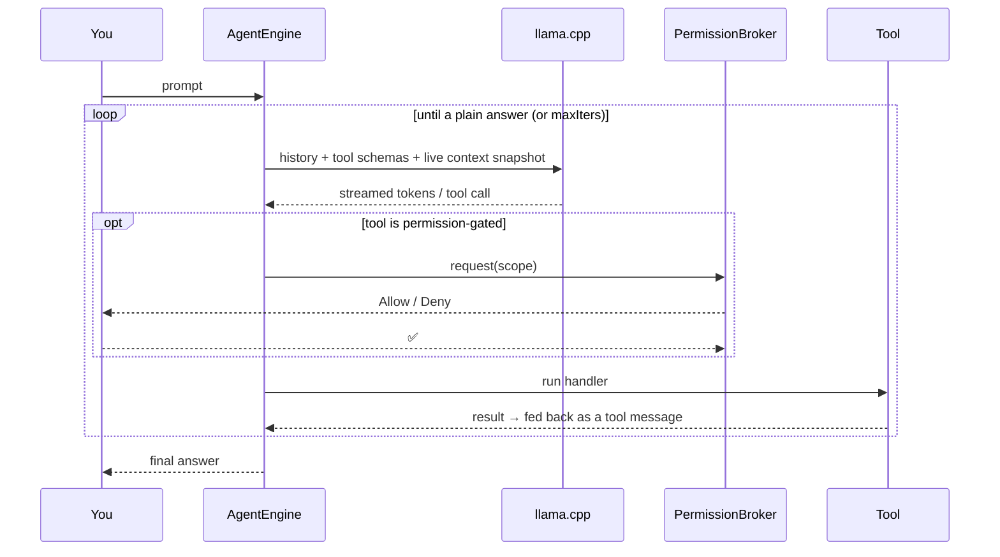
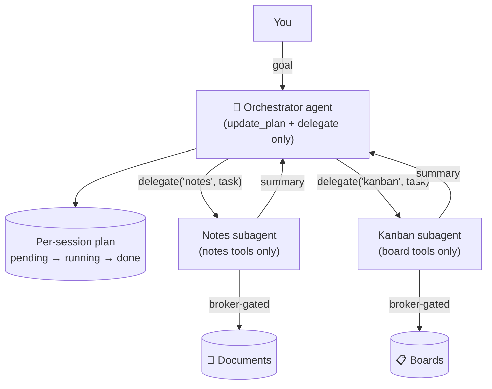

# A private, local-first AI workspace

**An agentic workspace where the AI lives *inside* your work — reading, editing, planning, and
remembering — and not a single byte ever leaves your machine.**

Most "AI in your app" experiences are a chat box bolted onto someone else's cloud. This is the
opposite: a tool-using agent backed by a **local llama.cpp model**, embedded directly in your
documents and boards, that acts only with your explicit permission. No cloud. No telemetry. No
third party who could store, sell, or leak your words. The privacy guarantee isn't a feature —
it's the foundation every other decision is built on.

---

## Why it's different

- **🔒 Private by construction.** The model runs on *your* hardware. Documents, chat history,
  memory, and image blobs all persist locally in IndexedDB. Fonts are bundled, not fetched. There
  is no CDN, no analytics, no "anonymous usage data." Turn off your network and it still works.
- **🤝 An ambient collaborator, not a chatbot.** The agent sees what you're working on and helps
  *in place* — rewriting a paragraph, filling a Kanban board, drafting a doc — instead of making
  you copy-paste into a sidebar.
- **✋ You're always in control.** Every read, write, and network action flows through a single
  **default-deny permission broker**. Edits are gated by *reviewing the diff*: the agent proposes,
  you accept. Nothing touches your work without your yes.
- **🧠 It learns you.** The assistant remembers durable facts and preferences — visible and
  manageable in the Memory panel — so it gets more useful over time.
- **🧭 It can drive multi-step work.** An orchestrator agent decomposes a goal into a plan and
  delegates each step to focused per-feature subagents ("plan my housework" → draft a plan doc →
  populate the board).
- **🎨 It's a joy to look at.** Six bespoke, hand-tuned themes — from a heavy-phosphor CRT terminal
  to Game Boy dot-matrix to Synthwave — all driven by a tiered design-token system.

---

## The workspace

A tiled, drag-to-rearrange, multi-panel app composed of independent **features**:

| Feature | What it is |
|---|---|
| **📝 Notes** | A true **WYSIWYG** Markdown editor (Milkdown) where Markdown is always the source of truth. The agent reads it, proposes edits as an **in-document rendered diff**, and you accept/reject per-change. Multi-document library with folders-free switching. |
| **📋 Kanban** | A native board: projects → boards → **nested sub-boards**, columns, cards (type / due date / checklists), HTML5 drag-and-drop. The agent can list, create, and move cards — with permission. |
| **🧭 Orchestrator** | A cross-cutting agent that keeps a **per-session plan** and **delegates** focused tasks to per-feature subagents. Multiple named sessions, each its own chat + plan. |
| **⚙️ Settings** | Swatch-card theme picker + the Memory panel. |
| **🎨 Style Guide** | A live gallery of the design-token system. |

Every chat surfaces a **live token meter** under the composer so you can watch the model's context
window in real time — handy when you're seeing how far a small local model can be pushed.

---

## Technical design

The system is **framework-agnostic core services → reusable modules → declarative feature
manifests → a thin React shell**. State lives in plain TypeScript classes; React is just the view.

```mermaid
flowchart LR
  subgraph Core["Core services — plain TS, no framework"]
    direction TB
    AE["AgentEngine<br/>(the agent loop)"]
    LC["LlamaClient<br/>(streaming + tool calls)"]
    PB["PermissionBroker<br/>(default-deny chokepoint)"]
    RG["Registry<br/>(tool collection)"]
    ST["Storage<br/>(IndexedDB / ScopedStore)"]
    MEM["MemoryStore"]
  end
  subgraph Mods["Modules — UI + agent tools"]
    direction TB
    DOC["Doc Editor"]
    KAN["Kanban"]
    ORCH["Orchestrator"]
    CHAT["AI Chat"]
  end
  subgraph Feat["Features — LayoutNode manifests"]
    direction TB
    F1["Notes"]
    F2["Board"]
    F3["Orchestrator"]
  end
  Shell["React Shell<br/>(WorkspaceShell + PanelArea)"]
  Core --> Mods --> Feat --> Shell
```



**The four layers**

1. **Core services** (`src/core/`) — framework-agnostic. The `PermissionBroker` (one default-deny
   chokepoint every read/write flows through), `LlamaClient` (OpenAI-compatible streaming + tool-call
   assembly), `AgentEngine` (the loop), `Registry`, `MemoryStore`, and a `StorageBackend` (IndexedDB
   in the browser, in-memory for tests) behind a namespaced `ScopedStore`.
2. **Modules** (`src/modules/*`) — each implements the `WorkspaceModule` contract
   (`{ id, title, locality, tools, render, layoutHints }`), declaring its own agent **tools** (each
   with an optional `permission`) and its **UI**.
3. **Features** (`src/features/*`) — a feature is a *declarative manifest*: a `LayoutNode` tree
   composing modules into a tiled layout.
4. **Shell** (`src/app/`, `src/shell/`) — `createServices()` is the composition root that wires
   everything; `App.tsx` renders it.

**State pattern.** Every stateful unit is a plain class extending `Emitter<TState>`: it holds an
immutable `state`, replaces it on mutation, and `notify()`s. React binds via a `useStore` hook
(`useSyncExternalStore`). No Redux, no context-soup — just classes and subscriptions.

### How the agent works

`AgentEngine.run()` sends your message + every registered tool schema to the model, streams the
response, and on a tool call routes through the registry → broker → handler, feeding results back
until the model returns a plain answer.



**Documents are special.** Edits aren't a broker pop-up — the agent calls `propose_edit`, which
enqueues a pending change; the editor panel swaps to a **rendered, in-document diff** (each edit
placed *in situ*, adapting inline vs. breakout vs. code), and *accepting the diff is the write
grant*. Markdown stays the source of truth via a Milkdown serialize round-trip.

### The orchestrator: delegation-first

The orchestrator's own tool surface is deliberately tiny — `update_plan` + `delegate` — which keeps
it stable on a small model. A `delegate` spins up a **transient subagent** on the *target feature's*
scoped registry, runs it (broker-gated), and reports a summary back into the linked plan step. New
features become delegation targets via a capability registry with **zero orchestrator changes**.



### Engineered for small models

A real theme of this project is *how far you can push a small local model*. Several mechanisms in
the `AgentEngine` exist specifically to keep a small model on the rails:

- **Live context injection** — a fresh state snapshot (active document, open board + columns +
  sub-boards, current plan) is folded into the system prompt *every run* (never persisted), so the
  agent knows the world instead of guessing. Subagents inherit their feature's snapshot.
- **Repeat-call loop-breaker** — if the model fires the same tool call more than twice in a run, the
  engine stops and says so, instead of grinding into a degenerate "let me try again" loop.
- **Instructive errors** — an unknown-tool call returns the list of tools the agent *does* have, so a
  wrong guess is recoverable rather than a dead end.
- **Context observability** — `estimatePromptSize`, a per-call `console.debug`, and the composer's
  live token meter make context growth visible (small windows fill fast).

---

## Tech stack

- **React 19 + TypeScript + Vite**, tested with **Vitest** (jsdom).
- **Milkdown** (ProseMirror) for the WYSIWYG editor — chosen because it round-trips Markdown with
  byte fidelity.
- **react-resizable-panels** for the tiled layout; **react-markdown / KaTeX / highlight.js** for
  rich chat rendering; **Hanken Grotesk** bundled locally.
- Local inference via **llama.cpp `llama-server`** (OpenAI-compatible API).
- Design language: a **tiered CSS design-token system** (base → semantic → per-theme effect tokens);
  themes are `[data-theme]` blocks. Components read only `var(--token)` — never raw hex.

### Project structure

```
src/
  core/        Emitter, AgentEngine, LlamaClient, PermissionBroker, Registry, MemoryStore, storage/
  modules/     docEditor/ · kanban/ · orchestrator/ · aiChat/ · permissionPrompt/ · memoryViewer/ · settings/
  features/    notes.ts · board.ts · orchestrator.ts · settings.ts · styleguide.ts   (layout manifests)
  app/         services.ts (composition root) · App.tsx
  shell/       WorkspaceShell · PanelArea · FeatureRail
  styles/      tokens.base.css · tokens.semantic.css · themes/*  · components.css
docs/          STATUS.md (living source of truth) · design-language.md · superpowers/{specs,plans}/
```

---

## Running the app

You need **[Node.js](https://nodejs.org)** and **[llama.cpp](https://github.com/ggml-org/llama.cpp)**'s
`llama-server`. The app **does not** start the model — you run it yourself.

### 1. Start your local model

```bash
llama-server --model "/path/to/model.gguf" --port 5174 --host 0.0.0.0 --jinja --alias local
```

- `--jinja` is **required** for tool-calling.
- `--alias local` makes the served model name `local` (matches `VITE_LLAMA_MODEL`).

> **WSL + Windows note.** A common setup is the app/Vite on the WSL side and `llama-server` (plus your
> browser) on Windows. `vite.config.ts` auto-detects the Windows host and proxies `/llama` →
> `http://<host>:5174`, so the browser always calls the app **same-origin** (no CORS, no localhost
> mismatch). `.env.local` sets `VITE_LLAMA_URL=/llama/v1` and `VITE_LLAMA_MODEL=local`. Open the app in
> a **Windows** browser. (If you run everything on one host, point `VITE_LLAMA_URL` straight at the
> server, e.g. `http://localhost:5174/v1`.)

### 2. Install and run the app

```bash
npm install
npm run dev
```

Open the URL Vite prints (usually **http://localhost:5173**) and start working. Your assistant is
ready — and nothing you type goes anywhere but your own machine.

### Useful commands

```bash
npm run dev          # Vite dev server
npm test             # full Vitest suite once
npm test -- <name>   # run matching test files, e.g. npm test -- agentEngine
npm run test:watch   # watch mode
npx tsc -b --noEmit  # typecheck
npm run lint         # ESLint
npm run build        # tsc -b && vite build
```
